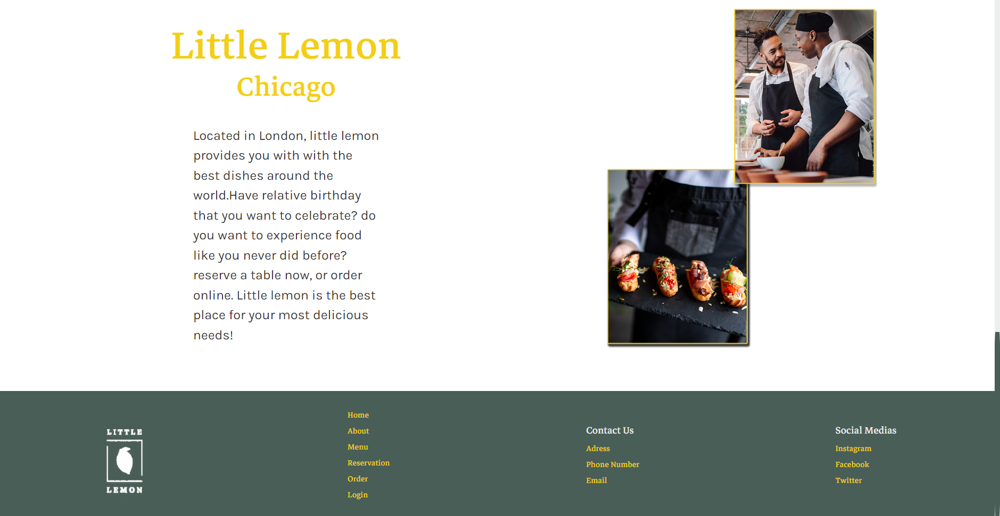
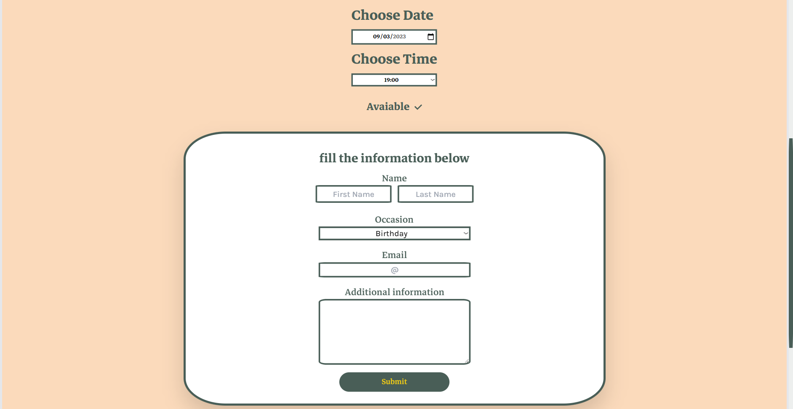

# Little Lemon website

This is a concept website for a restaurant named Little Lemon, which included the home page of the site + the reserving a table page

## Table of contents

- [Overview](#overview)
  - [The challenge](#the-challenge)
  - [Screenshot](#screenshot)
  - [Links](#links)
- [My process](#my-process)
  - [Built with](#built-with)
  - [What I learned](#what-i-learned)
  - [Continued development](#continued-development)
  - [Useful resources](#useful-resources)
- [Author](#author)

## Overview

### The challenge

- Build out the project to the designs provided
- Making sure it's fully responsive and works for all screen widths
- Making sure the reserve a table page and forms inside it comply to Ux/Ui design prenciples

### Screenshot

### Links

- Live Site URL: ()

## My process

### Built with

- Semantic HTML5 markup
- CSS custom properties
- Tailwind CSS
- Flexbox
- CSS Grid
- Mobile-first workflow
- [React](https://reactjs.org/) - JS library
- [TailwindCss](https://tailwindcss.com/) - CSS framework
- [Form library](https://formik.org/) - For forms
- [Yup library](https://www.npmjs.com/package/yup/) - For form validation
- [Framer Motion library](https://www.framer.com/motion/) - For element animations
- [Figma](https://www.figma.com/) - For designing mockups

### What I learned

By working on this project, I have enhanced my skills in website design by creating visually appealing and functional designs based on provided requirements and style guides. I have successfully translated these designs, created using Figma, into a fully functional React application that prioritizes the user experience and follows UI/UX design principles.

One notable aspect of this project was my introduction to Tailwind CSS. It was a delightful experience as it significantly sped up the styling process and offered convenient utilities for styling elements. The responsive table, which dynamically adjusts based on the number of seats selected by the user, is a highlight of my website. It provides a seamless user experience and adapts to user input in real time. Additionally, the form element intelligently checks the availability of the selected table at the specified date and time.

Furthermore, I integrated animations using Framer Motion, which simplified the process and allowed me to create engaging and smooth animations throughout the application. These animations enhance the overall user experience and bring elements to life.

Overall, this project has been a valuable learning experience, improving my proficiency in web design, frontend development with React, and the utilization of modern tools and libraries like Tailwind CSS and Framer Motion.
### Continued development

In future work, I am aiming to improve my animation skills to make my websites more lively and fun, and also aim to improve my code clarity.

### Useful resources

- [TailWindCss documentation](https://tailwindcss.com/docs/installation) - This made using TailWindCss very easy and straightforward, as long as you have the CSS knowledge transitioning to TailWind is simple.
- [Framer Motion documentation](https://www.framer.com/motion/) - Framer Motion made making animations much simpler and their documntation are perfect for any idea you have in mind.
- [W3Schools Css Refrence](https://www.w3schools.com/cssref/index.php) - It has any questions you might have about Css answered with live examples, which is very good for any type of Css research.

## Author

- LinkedIn - [Marvellous Bamisaye](https://www.linkedin.com/in/marvellous-bamisaye-b7858524a/)
